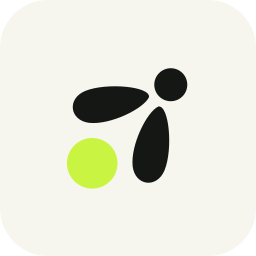

<p align="center">
  
</p>

<h1 align="center">slock</h1>

<p align="center"><strong>Two computers... one-bit. A tiny E2E encrypted messenger, tucked inside your capslock key.</strong><br>
</p>

<p align="center">
  <a href="https://github.com/jonaraphael/slock/releases/latest/download/slock.app.zip"></a>
</p>

<p align="center">
  <a href="https://github.com/jonaraphael/slock/releases/latest"></a>
  <a href="https://github.com/jonaraphael/slock/actions/workflows/check.yml"></a>
  <a href="LICENSE"></a>
  
</p>

Hold Caps Lock on your Mac. A little light comes on on someone else’s keyboard.
Let go, and it goes off.

That’s the whole idea. Caps Lock has spent quite enough time shouting. It can
have a small, gentle job now.

slock lives in your menu bar and connects exactly two Macs. Send a tiny hello,
invent a secret blink language, or sit at opposite desks and be a little
ridiculous. If you both opt in, the same key becomes a walkie-talkie.

The firefly is **Dit**. Dit has one light and considerable enthusiasm.

## Why you might like it

- **It’s ambient, not another chat window.** No notifications, no unread badge,
  no typing. Just a light that means *someone is thinking of you right now.*
- **It’s private by construction.** Every message is end-to-end encrypted between
  your two Macs. There are no accounts, no server that knows who you are, and no
  analytics. The relay only sees ciphertext and routing.
- **It’s tiny and open.** Two Swift files, no third-party libraries, no Xcode
  project required. Read the whole thing over a coffee, then build it yourself.

> **An honest note before you download.** slock is an experiment with rough
> edges. It uses a public MQTT test relay, is not notarized (macOS will ask you to
> confirm the first launch), and its encryption has no forward secrecy. Keyboard
> lights also vary by model. Please use it with someone you trust and keep
> sensitive conversations elsewhere.
> [The security details](SECURITY.md) · [What’s been tested](VALIDATION.md)

## Give it a blink

You’ll need two Macs running macOS 13 or newer, an internet connection, and one
willing accomplice.

1. **Install.** Download **slock.app.zip** on both Macs, unzip it, move
   **slock.app** to **Applications**, and open it. If macOS blocks the first
   launch, see [Apple’s instructions for opening an app from an unidentified developer](https://support.apple.com/en-us/102445).
2. **Grant keyboard access.** Follow the **Permissions Required** guide for
   Accessibility and Input Monitoring. slock explains where to click; macOS
   handles the approvals.
3. **Share a code.** On one Mac, open **Pairing…**, copy your code, and send it
   to the other person through a channel you trust.
4. **Pair.** On the other Mac, paste it into **Other Mac’s pairing code** and
   choose **Send Pairing Request**. Back on the first Mac, choose **Review Pair
   Request from …**, compare the complete pairing codes with your person, then
   **Accept Pairing**. A nickname alone doesn’t verify who’s there.
5. **Blink.** Wait for the connection, then hold Caps Lock. Your person gets a
   light. You have successfully sent one very small hello.

Light signals start as soon as they arrive. Short blinks and gaps retain their
timing when packets arrive in time; a hold or gap longer than one second resets
playback to the earliest opportunity. Hold **Option** in the menu and choose
**Test Caps Lock Light** to check whether your keyboard’s LED cooperates. Some
keyboards are more willing participants than others.

While slock is active, Caps Lock stops capitalizing text. Your keyboard light
follows the *other person’s* key; Dit’s tail shows your own outgoing activity.
**Pause Slock** hands Caps Lock its old job back whenever you like.

## A tiny walkie-talkie, too

1. One person chooses **Invite Peer to Enable PTT**.
2. The other chooses **Accept PTT Invitation**.
3. Both grant microphone access. Once both menus show **PTT Enabled**, hold
   Caps Lock to talk and release it to stop.

Both people must agree, and either can turn it off for both. Only one person
talks at a time; if you press together, the apps pick one sender consistently.
Excellent practice for saying “over.” Voice is end-to-end encrypted Opus and
runs independently of light timing.

**Do Not Disturb and other Focus modes pause voice on your Mac**, including an
ongoing talk. Light signals keep working, and both people’s PTT consent stays
enabled. Once Focus is off, release Caps Lock and hold it again to talk; interrupted
audio is discarded. The menu shows **Audio Paused** while Focus is active. If
macOS’s Focus status cannot be read, voice stays paused and the menu explains why.

## Getting to know Dit

| What you see | What it means |
| --- | --- |
| **Yellow-green tail** | You’re holding the key or transmitting. Hello, person. |
| **Slowly pulsing green tail** | Pairing was accepted. Ready for the first light signal in either direction. |
| **Blue tail** | Your paired Mac is unavailable: offline, paused, or still connecting. |
| **Red tail** | A required permission is missing, or a pairing/PTT request needs attention. |
| **Hollow tail** | No outgoing activity. An incoming signal appears on your keyboard’s light. |

With Reduce Motion enabled, the accepted-pairing tail stays steady green.

A few useful things in the menu:

| Control | What it does |
| --- | --- |
| **Pause Slock / Resume Slock** | Give Caps Lock its old job back, or return to blinking. Pause also stops voice. |
| **Pairing…** | Connect, name your Mac, or save nicknames. |
| **Recent** | Revisit a past pairing. Reconnecting sends a fresh request. |
| **Unpair** | Disconnect immediately and stop lights and voice. |
| **Launch at Login** | Start slock when you sign in. Turned on at first launch when macOS allows it; switch it off here. |
| **Check for Updates… / Update slock…** | Checks the latest release, downloads and verifies it, then replaces and relaunches slock in place. |
| **Quit slock** | Restore the previous keyboard mapping and let Dit clock out. |

When either Mac unpairs, the other returns to **Unpaired** too. If the message is
missed, the other Mac catches up when both Macs are online and check in.

Hold **Option** in the menu to reveal **This Mac** (your fingerprint), **Test
Caps Lock Light**, **Diagnostics…**, and the installed version.

## Privacy at a glance

- **What slock sees.** To catch Caps Lock, macOS requires Accessibility and Input
  Monitoring, which technically expose all key events to the app. slock acts only
  on Caps Lock and the F18 key it is remapped to, passes everything else through
  untouched, and never records, stores, or transmits other keystrokes.
- **What leaves your Mac.** Encrypted key up/down events, your chosen nickname,
  and (only with mutual push-to-talk consent, while you hold the key) encrypted
  voice. The relay and any observer can see your public key, timing, and message
  sizes, but not content.
- **What stays on your Mac.** Your identity key in a private folder, your recent
  pairings, and your settings. Nothing is sent to the author. The only other
  network traffic outside the relay is a version check against GitHub at launch
  and hourly, plus the update download when you choose to install one.
- **What it never does.** No accounts, no telemetry, no ads, no contacts access,
  no clipboard reading. The microphone is used only during a consented, held
  push-to-talk transmission.

Full details, including the limits of the current relay and encryption, are in
[SECURITY.md](SECURITY.md). Found a vulnerability? Please use
[private reporting](https://github.com/jonaraphael/slock/security/advisories/new).

<details>
<summary><strong>macOS is asking questions. Understandable.</strong></summary>

Releases from **0.3.0** are signed with Developer ID but are **not notarized**, so
macOS may still block the first launch. See
[Apple’s instructions for opening an app blocked by macOS](https://support.apple.com/en-us/102445).

Keep slock in Applications so permissions and the login item use a stable path.
The app needs **Accessibility** and **Input Monitoring** for keyboard capture.
It requests each keyboard permission automatically once; the setup guide returns
whenever a required grant is missing, including after an update.

Older releases used ad-hoc signatures that changed the app's identity with each
build. Version **0.3.0** switches to a persistent Developer ID identity, so
later consistently signed releases should retain existing privacy approvals.
This first switch may require one final approval on each Mac. The updater's
separate download signature continues to verify update packages.

- A permission marked **Enabled** needs no further action. Capture waits until
  both keyboard permissions are granted.
- If slock is missing from a permission list, click **+** and add the installed
  app. **Show App in Finder** reveals the running copy.
- If an old entry is already enabled but capture fails, remove it and add the
  current copy. Quit and reopen slock if macOS asks.
- Granting permissions while slock is paused keeps it paused. Choose
  **Resume Slock** when you’re ready.

The red **Permissions Required** item appears only while the current mode lacks
access. Push-to-talk adds **Microphone** after you choose to enable it; receiving
an invitation alone never requests microphone access. **Use lights only** turns
PTT off and removes that requirement. Physical **F18** is also consumed while
capture is active.

</details>

<details>
<summary><strong>Names, old friends, and updates</strong></summary>

Sending a pairing request shares your nickname with its recipient. The recipient
shares theirs after accepting. A nickname you give someone else stays on your
Mac and is used if they haven’t supplied their own. **Save Nicknames** edits names
without starting another pairing request. Names are for convenience, not identity:
always compare the full pairing code or the **This Mac** fingerprint.

**Recent** lists accepted pairings, newest first. It uses the other Mac’s name,
then your local nickname, then the last six characters of its code. Unpairing
keeps this history but clears active voice consent. Switching to another Mac asks
before disconnecting your current peer.

slock checks GitHub for updates at launch and hourly. **Check for Updates…** is
always available and becomes **Update slock…** when a newer release is known.
Either action checks the latest release again, downloads and verifies its signed
update, then replaces slock and relaunches it in the same location. No extra
updater, administrator access, or Keychain permission is required. Keep slock in
a writable Applications folder. Pairings and preferences stay. Moving from an
older ad-hoc release to **0.3.0** may require one final keyboard permission
approval; later releases use the same Developer ID identity.

Versions **0.2.6–0.2.8** only open a release page. Download the latest ZIP once,
quit slock, replace the app in Applications, and reopen it to receive the restored
updater. Upgrade both Macs together: version 0.2 uses protocol 2 and cannot
communicate with version 0.1.

</details>

## Small app, real caveats

This is still a prototype. Bug reports are welcome, especially from keyboards
that have decided to express themselves in unexpected ways.

- **Lights are best-effort.** The main target is a MacBook’s built-in keyboard.
  Some external keyboards cannot control the LED independently. slock reports
  that instead of turning on system Caps Lock to fake a light.
- **The relay is a public testing service.** slock uses
  `wss://test.mosquitto.org:8081/mqtt`. Availability is not guaranteed; other
  clients can send spam or interrupt delivery. A production service would need an
  operated broker with per-user authentication and abuse controls.
- **Encryption has limits.** Key states, nicknames, and voice are encrypted with
  X25519, HKDF-SHA256, and ChaCha20-Poly1305. If either Mac’s private identity
  key is later stolen, recorded traffic can be decrypted: there is **no forward
  secrecy**. Keep identity files and backups private.
- **Recovery isn’t magic.** slock preserves existing keyboard mappings and
  restores them when capture stops or the app quits. After a crash, the next
  launch uses a recovery journal. Force-quitting or losing power cannot run
  immediate cleanup.

Curious how the blinking sausage is made? See [the architecture](ARCHITECTURE.md).

<details>
<summary><strong>If the little light doesn’t light</strong></summary>

Start with **Option → Diagnostics…** in slock’s menu. Pairing tells you the Macs
can communicate; each still needs working keyboard capture and LED access.

| What’s happening | What to try |
| --- | --- |
| Caps Lock still capitalizes or shows a blue cursor indicator | Check **Accessibility trusted: true** and **Caps capture active: true** in Diagnostics. Look for another Caps Lock utility or an existing Modifier Keys reassignment. |
| Permissions look enabled, but nothing happens | Open **Permissions Required** if shown. Remove stale Accessibility/Input Monitoring entries, add the current app from Applications, and reopen if macOS asks. |
| The light test fails | Check **LED mode**, **HID listening access**, and **LED error**. Grant Input Monitoring if requested. The keyboard may not support independent LED control. |
| The other Mac stays offline | Check both app versions, internet connections, and access to `test.mosquitto.org` on TCP port `8081`. The test broker may also be having a day. |
| Voice is silent | Both menus should show **PTT Enabled**. Check Microphone permission and system input/output devices, then the first audio error in Diagnostics. |
| Launch at Login needs approval | Allow slock in **System Settings → General → Login Items**. |

**Local Caps presses** should increase when you hold the key. If it stays at zero,
check permissions and the keyboard event mask (required: `7168`). **Key messages
queued** on the sender and **Key messages received** on the recipient help
separate capture trouble from delivery trouble. Queued does not mean delivered.

For a stale Input Monitoring entry that won’t budge, you can reset only slock’s
record, then reopen the installed app and follow the guide:

```sh
tccutil reset ListenEvent com.jonaraphael.CapsLink
```

The LED driver retries after keyboard access is granted. If the light changes
independently of your peer, check for another Caps Lock utility using the same
Caps→F18 mapping. Network stalls or a busy Mac can also stretch a blink or gap;
the next hold or gap longer than one second lets playback shed accumulated delay.

For a useful bug report, include both Mac models, macOS and app versions, keyboard
types, and whether capture, the light test, and voice each work. **Copy Diagnostics**
helps, too—please review it before sharing, since it contains device fingerprints
and activity counters. Thank you for helping a very small firefly find its feet.

</details>

## Build from source

Install Xcode or the Xcode Command Line Tools, then run:

```sh
git clone https://github.com/jonaraphael/slock.git
cd slock
./build.command
```

The build renders Dit’s [vector artwork](docs/images/firefly.svg) into an app
icon and produces a universal app plus a distributable ZIP in `dist/`. Signing
defaults to ad-hoc. There is no Xcode project and no third-party dependency;
the default build needs no internet access.

```sh
CAPSLINK_ARCHS=arm64 ./build.command  # one architecture only (or x86_64)
./test.command                        # regression, security, and timing suites
```

To keep a stable macOS identity across builds, save a code-signing certificate
fingerprint from `security find-identity -v -p codesigning` in the Git-ignored
`.release-signing/codesign-identity` file, or set `SLOCK_CODESIGN_IDENTITY` for
one build. Use an Apple Development identity
for local development and a Developer ID Application identity for releases.
Certificate signing requests an online secure timestamp and fails if signing
fails; it never retries with an ad-hoc signature. Publication requires a
Developer ID Application signature. See
[release signing](docs/RELEASING.md#macos-code-signing-and-privacy-permissions)
for setup and migration details.

The tests use temporary identities, fake keyboard commands, and synthetic audio.
They never capture your keyboard, use your microphone, or contact the relay.
Maintainers can find the tagging and publishing steps in
[docs/RELEASING.md](docs/RELEASING.md).

### Project guide

| File | Purpose |
| --- | --- |
| [slock.swift](slock.swift) | Application, keyboard capture, pairing, relay, and audio. |
| [UpdateInstaller.swift](UpdateInstaller.swift) | Signed update verification, replacement, and relaunch. |
| [build.command](build.command) | Builds, packages, and signs the app. |
| [test.command](test.command) | Runs the [regression suite](Tests/RegressionTests.swift) and friends. |
| [docs/releases/](docs/releases/) | Changelog and upgrade notes for each release. |
| [ARCHITECTURE.md](ARCHITECTURE.md) | Design, protocol, state machines, and manual test plan. |
| [VALIDATION.md](VALIDATION.md) | Verified results and remaining hardware checks. |
| [SECURITY.md](SECURITY.md) | Privacy, security limits, and private vulnerability reporting. |
| [SECURITY_REVIEW.md](SECURITY_REVIEW.md) | Security reviews, fixes, and verification. |

slock was previously called **CapsLink**. Internal preference keys, the identity
storage directory, bundle identifier, and wire identifiers keep the old name so
existing settings and pairings keep working.

## Contributing

Issues and pull requests are welcome. Keep changes small, add a regression test
where one fits, and run `./test.command` before opening a PR. For anything
security-related, please use private reporting first.

## License

[MIT](LICENSE). See [third-party notices](THIRD_PARTY_NOTICES.md) for attribution.
Dit is happy to be forked, as long as the light stays gentle.
